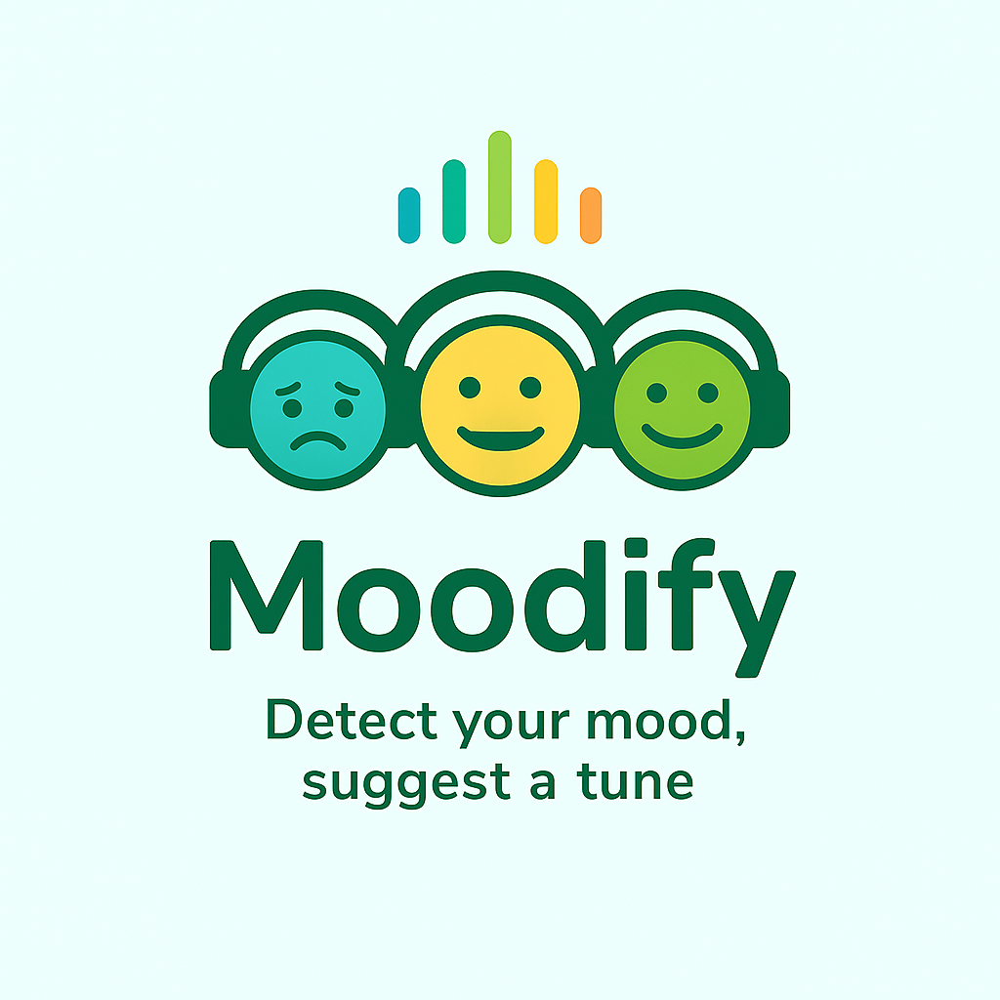

# Moodify 🎵✨

Moodify es una aplicación innovadora que transforma cualquier foto en la **banda sonora de tu estado de ánimo**. Detecta tu emoción a partir de una imagen (webcam o subida) y genera una playlist personalizada basada en *energy*, *valence* y *tempo* mediante la API oficial de Spotify.

---

## 🌟 ¿Qué es Moodify?

Moodify combina **inteligencia artificial, visión por computadora y análisis musical** para ofrecer una experiencia única: que la música que escuchas refleje cómo te sientes.  
Cada usuario puede descubrir canciones que coincidan con su emoción actual de manera **rápida, intuitiva y divertida**.

---

## ❓ Por qué este proyecto

- La música influye profundamente en nuestras emociones, pero **encontrar la playlist adecuada puede ser difícil y consumir tiempo**.  
- Queremos **simplificar la experiencia** de encontrar música que realmente acompañe tu estado de ánimo.  
- Queremos ofrecer **privacidad**, evitando que las imágenes se suban a servidores públicos innecesariamente.

---

## 🛠 Problemas que resuelve

- **Dificultad para encontrar música adecuada al estado emocional.**  
- **Pérdida de tiempo buscando playlists** en múltiples plataformas.  
- **Falta de personalización real**, donde las playlists no reflejan la emoción exacta.  
- **Preocupaciones de privacidad** al subir imágenes a servicios externos.

---

## 💎 Valor que aporta

- **Experiencia personalizada:** cada usuario recibe música que se adapta a su emoción.  
- **Interfaz rápida y visual:** Streamlit ofrece análisis instantáneo y visualización elegante.  
- **Privacidad y control:** el procesamiento puede realizarse localmente.  
- **Innovación tecnológica:** combina Deep Learning, visión por computadora y recomendación musical basada en métricas objetivas.

---

## 🚀 Cómo funciona

1️⃣ **Subida o captura de imagen**  
   - El usuario puede subir una foto o usar la cámara en tiempo real.

2️⃣ **Detección de emoción**  
   - Modelo entrenado con **TensorFlow/Keras** (`model.h5` y `model.tflite`) detecta la emoción predominante.

3️⃣ **Conversión a perfil musical**  
   - Mapeo de la emoción a *energy*, *valence* y *tempo*.

4️⃣ **Recomendación de canciones**  
   - Motor propio cruza el perfil emocional con un dataset de Spotify (`songs_clean.csv` y `spotify_processed.csv`) y genera una playlist variada y sin duplicados.

5️⃣ **Visualización y reproducción**  
   - Interfaz en **Streamlit** que muestra las canciones y permite reproducirlas mediante la API oficial de Spotify.

---

## 🔧 Tecnologías

- **Deep Learning:** TensorFlow / Keras  
- **Modelo ligero:** TFLite para despliegues rápidos y móviles  
- **Interfaz:** Streamlit  
- **Motor de recomendación:** Python (`reco_engine.py`) + dataset de Spotify  
- **API externa:** Spotify API para reproducción de canciones  

---

## 🔒 Privacidad

- Procesamiento local posible.  
- No se almacenan imágenes ni se suben a servidores externos.  
- Transparencia total en el tratamiento de datos.  

---

## 📈 Próximos pasos / Roadmap

- Mejoras en robustez del detector de emociones.  
- Filtros por idioma, popularidad y “mood tuning”.  
- Reproducción directa integrada en la interfaz.  
- Optimización TFLite y medición de latencia en dispositivos móviles.  
- Tests unitarios y CI/CD de la pipeline de datos.  

---

## 📂 Demo y código

- **Demo en vivo:** [https://moodify-beta.streamlit.app/](https://moodify-beta.streamlit.app/)  
- **Repositorio GitHub:** [https://github.com/xProSergi/Moodify](https://github.com/xProSergi/Moodify)  

---

## 👥 Equipo

- **Sergio López**  
- **Julián Sacristán Vargas**  
- **Joel Forteza**

---

